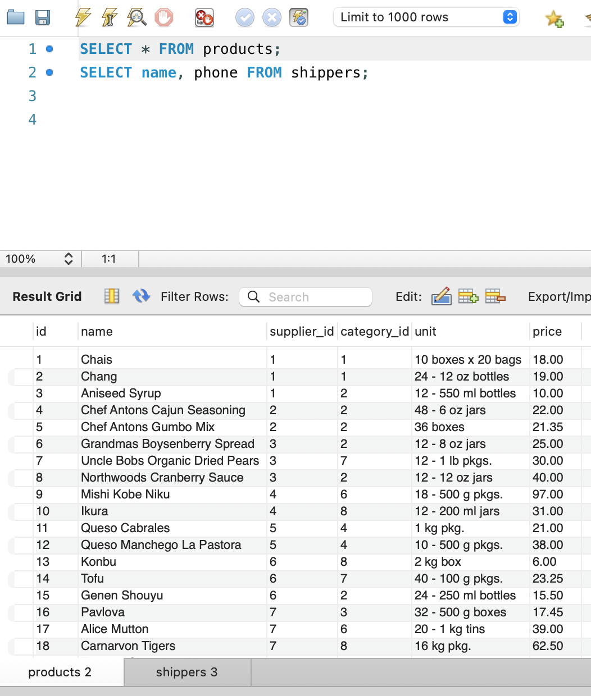
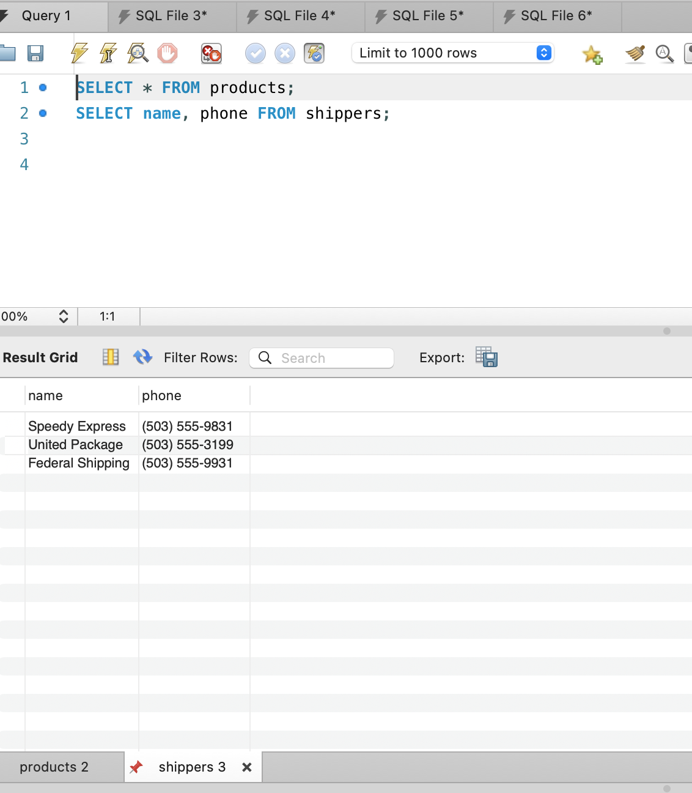
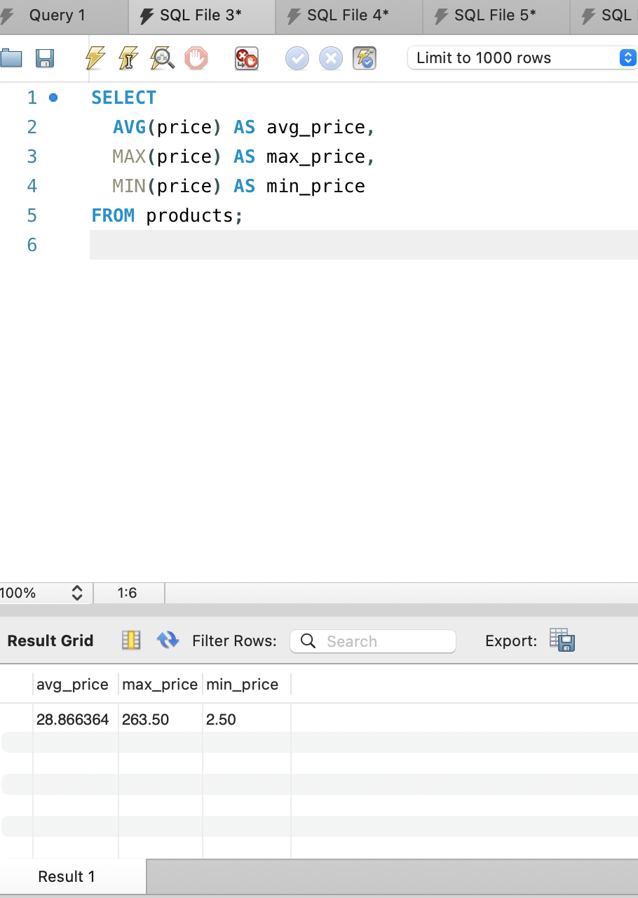
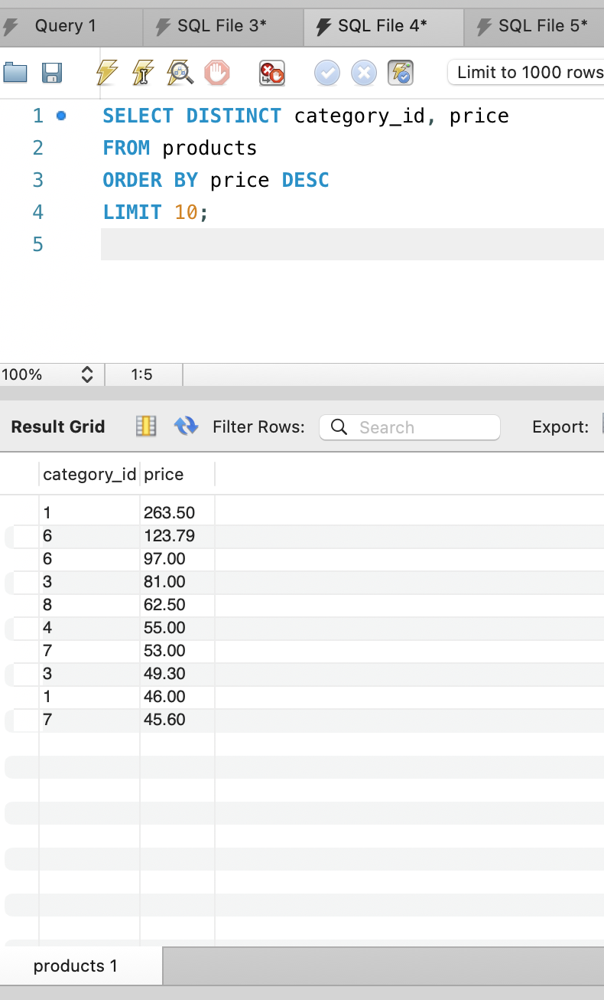
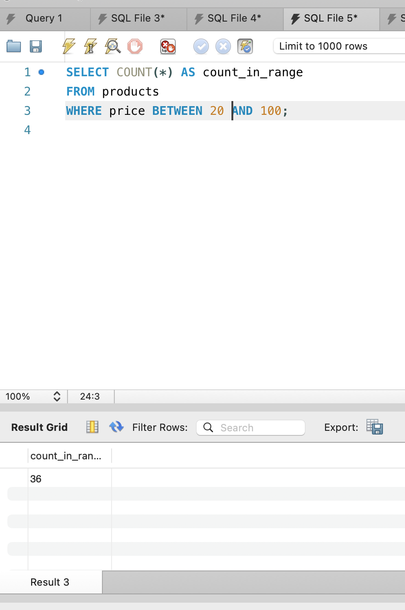
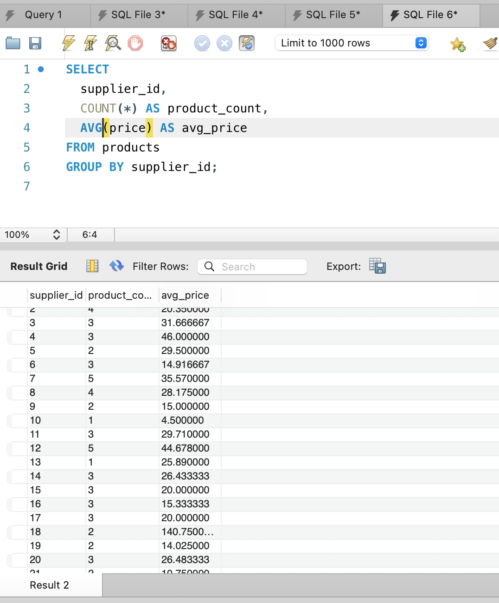

## Домашнє завдання до Теми 3. Завантаження даних та основи SQL. DQL команди 

### 1. Напишіть SQL команду, за допомогою якої можна:

вибрати всі стовпчики (За допомогою wildcard “*”) з таблиці products;
вибрати тільки стовпчики name, phone з таблиці shippers,
та перевірте правильність її виконання в MySQL Workbench.

```sql
-- Вибрати всі стовпчики з таблиці products
SELECT * FROM products;
```
[products_all.csv](products_all.csv)

<a href="products_all.png">
  
</a>

```sql
-- Вибрати лише name та phone з таблиці shippers
SELECT name, phone FROM shippers;
```
[shippiers_name_phone.csv](shippiers_name_phone.csv)

<a href="shippiers_name_phone.png">
  
</a>

### 2. Напишіть SQL команду, за допомогою якої можна знайти середнє, максимальне та мінімальне значення стовпчика price таблички products
та перевірте правильність її виконання в MySQL Workbench*.*

```sql
SELECT 
  AVG(price) AS avg_price,
  MAX(price) AS max_price,
  MIN(price) AS min_price
FROM products;
```
[average_price.csv](average_price.csv)

<a href="average_price.png">
  
</a>

### 3. Напишіть SQL команду, за допомогою якої можна обрати унікальні значення колонок category_id та price таблиці products.

Оберіть порядок виведення на екран за спаданням значення price та виберіть тільки 10 рядків. Перевірте правильність виконання команди в MySQL Workbench.
```sql
SELECT DISTINCT category_id, price
FROM products
ORDER BY price DESC
LIMIT 10;
```
[unique_category_price.csv](unique_category_price.csv)

<a href="unique_category_price.png">
  
</a>

### 4. Напишіть SQL команду, за допомогою якої можна знайти кількість продуктів (рядків), які знаходиться в цінових межах від 20 до 100, та перевірте правильність її виконання в MySQL Workbench.

```sql
SELECT COUNT(*) AS count_in_range
FROM products
WHERE price BETWEEN 20 AND 100;
```
[count_20_100.csv](count_20_100.csv)

<a href="count_20_100.png">
  
</a>

### 5. Напишіть SQL команду, за допомогою якої можна знайти кількість продуктів (рядків) та середню ціну (price) у кожного постачальника (supplier_id), та перевірте правильність її виконання в MySQL Workbench.

```sql
SELECT 
  supplier_id,
  COUNT(*) AS product_count,
  AVG(price) AS avg_price
FROM products
GROUP BY supplier_id;
```
[count_average.csv](count_average.csv)

<a href="count_average.png">
  
</a>
